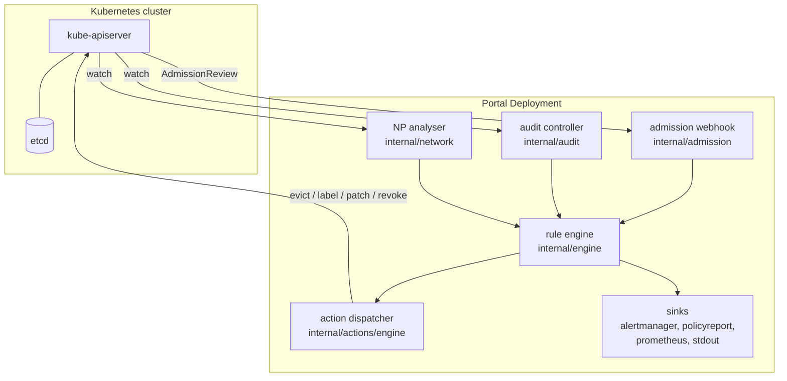

# Architecture

## Layer model

Portal sits across the API-server and control-plane layers:

- **Layer 4 — Admission** (`internal/admission`): TLS `ValidatingWebhookConfiguration`. Synchronous, pre-persistence.
- **Layer 5 — Audit** (`internal/audit`): informer-driven; events on persisted objects.
- **Layer 6 — Network** (`internal/network`): declarative NetworkPolicy graph analyser. Re-runs on informer events from layers shared with audit.
- **Layer 7 — Runtime** (v2): K8s API-audit-log source. Not enabled in v1.



## Module dependency graph

The repo enforces a one-way dependency on `internal/api`:

> Every `internal/*` package may depend on `internal/api`. Nothing else may depend on `internal/{admission,audit,network,actions/...}`.

`internal/api` contains pure interfaces and DTOs ([`internal/api/rule.go`](../../internal/api/rule.go), [`engine.go`](../../internal/api/engine.go), [`action.go`](../../internal/api/action.go), [`sink.go`](../../internal/api/sink.go), [`source.go`](../../internal/api/source.go)). Implementations register themselves at `init()` time via `api.RegisterEngine`, `api.RegisterAction`, `api.RegisterSink`.

## Pipeline

Every event source feeds the same pipeline:

```mermaid
flowchart LR
  Sources[admission / audit / network] --> CB[ContextBuilder]
  CB --> Engine[RuleEngine.Evaluate]
  Engine --> Violations[[]Violation]
  Violations --> Dispatcher[ActionDispatcher]
  Violations --> Sinks[OutputSink fan-out]
  Dispatcher --> Actions[alertmanager, label,<br/>annotate, evict,<br/>patch-networkpolicy,<br/>revoke-sa-token]
```

- **ContextBuilder** (`internal/context/pod` and the generic builder embedded in admission) normalises the raw `unstructured.Unstructured` into the env map exposed to expr-lang.
- **RuleEngine** (`internal/engine`) indexes rules by GVK and produces `[]Violation`.
- **ActionDispatcher** (`internal/actions/engine`) applies idempotency + rate-limit + worker pool semantics. See [actions-and-rate-limiting.md](actions-and-rate-limiting.md).
- **OutputSinks** receive every violation: AlertManager, PolicyReport, Prometheus, stdout-JSON.

## Per-layer toggles

Every layer is independently enable-able:

| Layer | CLI flag (`portal run`) | Helm value |
|-------|-------------------------|------------|
| Admission | `--admission` (default `true`) | `webhook.enabled` |
| Audit | `--audit` (default `false`) | `audit.enabled` |
| Network | `--network` (default `false`, implies audit) | `network.enabled` |

Portal in admission-only mode does not start informers; audit-only mode does not serve TLS. RBAC scope mirrors the toggles (see [../operator/rbac-scoping.md](../operator/rbac-scoping.md)).
